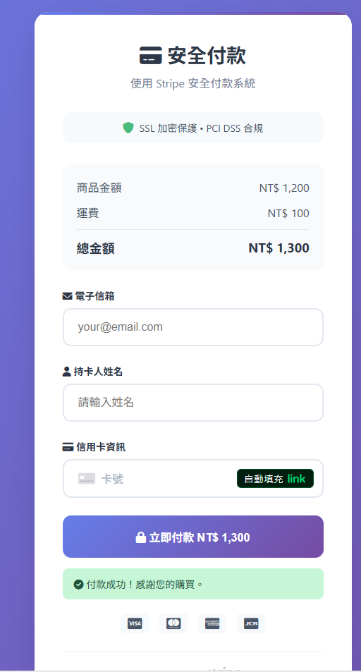

# Stripe Demo Project

This is a demo project that demonstrates how to integrate with Stripe for processing payments. It is a Spring Boot application that provides a single endpoint for creating a PaymentIntent with Stripe.



Reference this page ▼

[https://myawsbucketclarktest20250907.s3.ap-northeast-2.amazonaws.com/index.html](https://myawsbucketclarktest20250907.s3.ap-northeast-2.amazonaws.com/index.html)

## Building and Running the Project

To build and run the project, you can use the following Maven commands:

**For Windows:**
```bash
mvnw.cmd spring-boot:run
```

**For macOS and Linux:**
```bash
./mvnw spring-boot:run
```

## API Documentation

The API documentation for this project is automatically generated using SpringDoc and is available at [http://localhost:8080/swagger-ui.html](http://localhost:8080/swagger-ui.html) when the application is running.

The OpenAPI specification is also available at [http://localhost:8080/v3/api-docs](http://localhost:8080/v3/api-docs).

Alternatively, you can view the API documentation in the `openapi.yaml` file.

## Usage

You can use the following `curl` command to test the `/stripe/pay` endpoint:

```bash
curl -X POST http://localhost:8080/stripe/pay \
-H "Content-Type: application/json" \
-d '{
    "amount": 1000,
    "currency": "usd",
    "paymentMethodId": "pm_card_visa",
    "customerInfo": {
        "name": "John Doe",
        "email": "john.doe@example.com"
    }
}'
```
